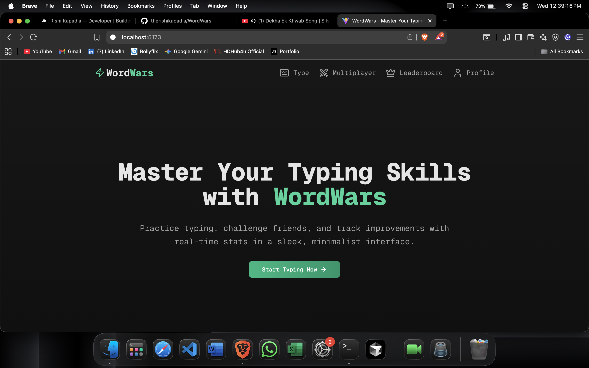
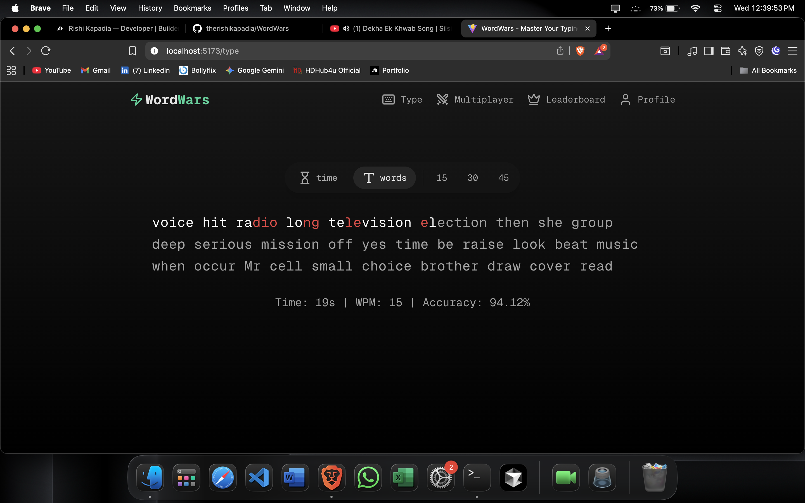
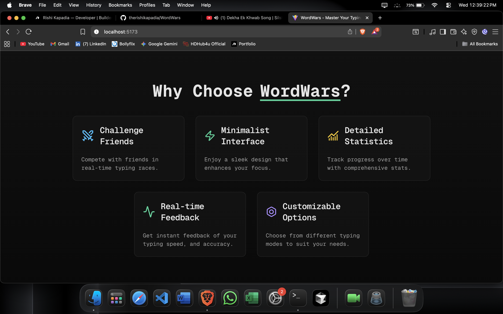

# 🧠 WordWars

WordWars is a fast-paced, real-time multiplayer word game where players race against the clock to form words from a given set of letters. Perfect for challenging your vocabulary and reflexes, whether you're playing with friends or competing globally.

---

## 🎮 Features

* 🔤 Real-time multiplayer word battles
* 🕹️ Interactive game lobby with room creation/joining
* 🧩 Random letter generation each round
* ⏱️ Timer-based gameplay to test quick thinking
* 🏆 Scoreboard to track performance
* 🎨 Vibrant UI with animated feedback

---

## 📸 Screenshots

| Hero Section | Gameplay Interface | Grid |
|-------------|------------------|-------------|
|  |  |  |


---

## 🚀 Tech Stack

| Frontend | Backend         | Realtime  | Database | Others      |
| -------- | --------------- | --------- | -------- | ----------- |
| React    | Node.js/Express | Socket.IO | MongoDB  | TailwindCSS |

---

## 🛠️ Installation & Setup

### 📦 Prerequisites

* Node.js (>= 16)
* npm or yarn
* MongoDB running locally or Atlas

---

### 🔧 Backend Setup

```bash
git clone https://github.com/your-username/wordwars.git
cd wordwars/backend
npm install
npm run dev
